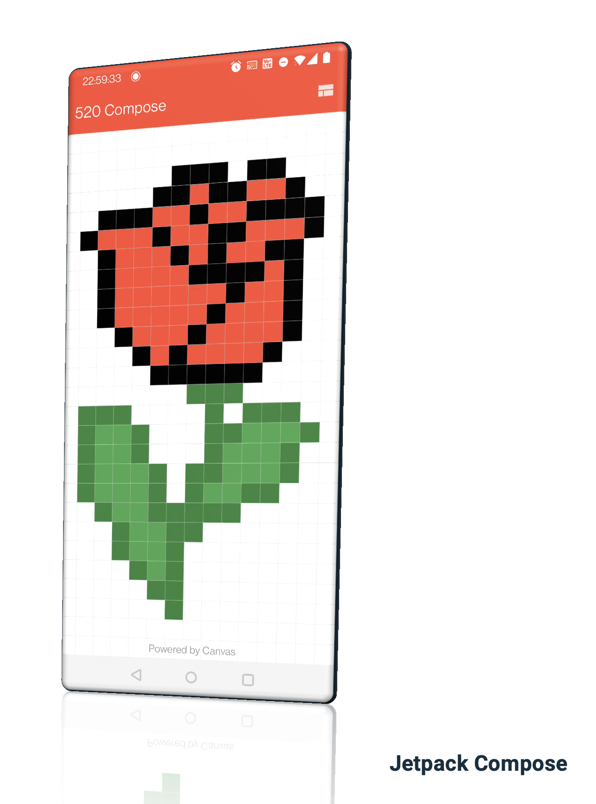

# 520 Compose

This repository demonstrates how to draw pixel images on a grid. The screen is divided into 20 x 24 grids. In each grid, we will draw a colored shape (or text, image, etc.). These shapes finally compose a picture. Since the app is created on May 20th, which day pronounce the same as "I Love you" in Chinese,  pictures include characters "520", a rose, and a heart.

Here is a short video for the app:

